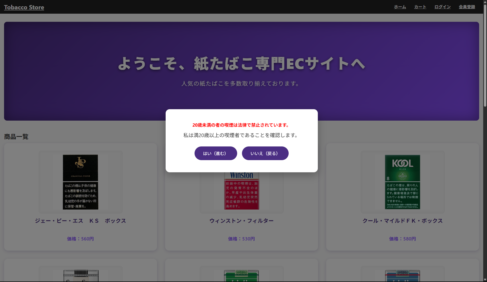
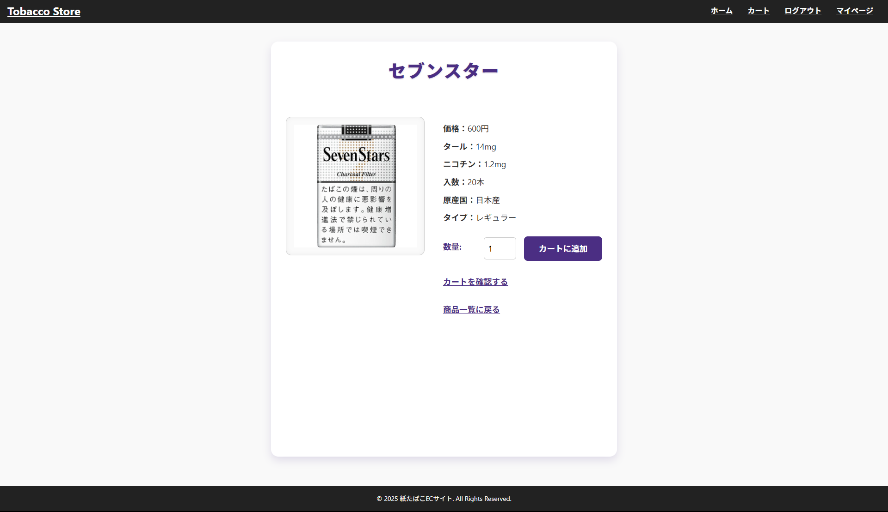
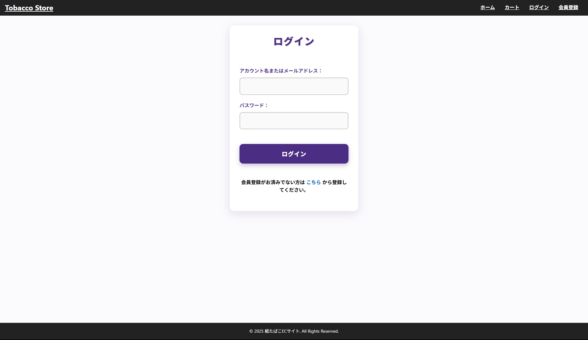
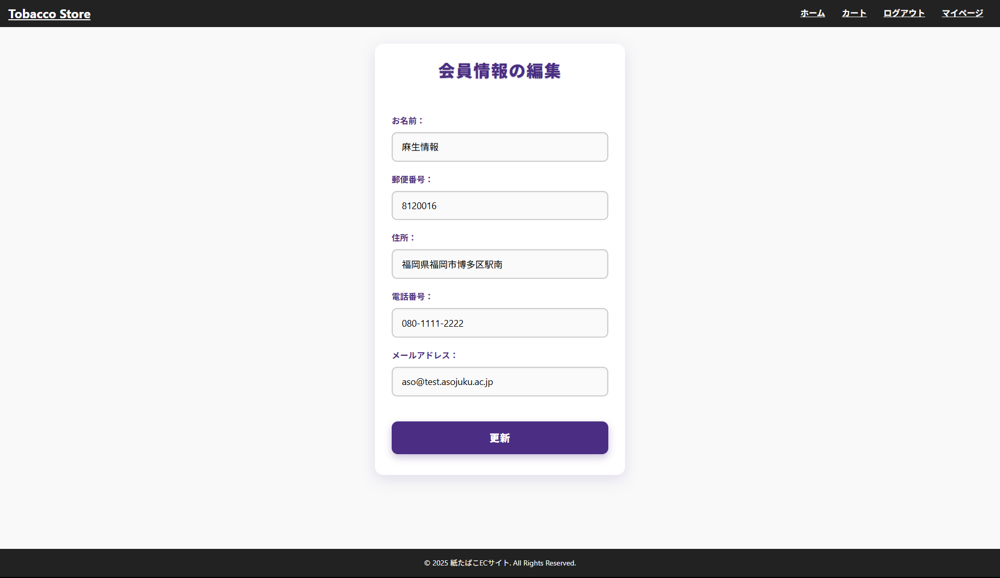

# ECレコメンド機能付きショッピングサイト

このプロジェクトは、PHPで構築されたショッピングサイトに対し、Python（Flask + TensorFlow Recommenders）で作成したレコメンドAPIを連携させたWebアプリです。

---

## 💻 開発環境（前提）

- OS：Windows 10/11
- Python：3.12系
- PHP：XAMPP 8.2以上（Apache + MySQL）
- GitHub：コード共有
- 仮想環境名：`.venv312`

---

## 🧪 セットアップ手順

### 🔸 0. リポジトリをローカルにクローン

```powershell
cd 任意の作業フォルダ
git clone https://github.com/TatsuyaTakigawa/ec-recommend-app.git
cd ec-recommend-app
```

---


### 🔸 1. XAMPPの準備（PHP環境）

1. XAMPPをインストール  
   https://www.apachefriends.org/index.html

2. `source/` フォルダを以下の場所にコピー  
   ```
   C:\xampp\htdocs\source
   ```

3. XAMPPコントロールパネルから Apache & MySQL を起動

4. phpMyAdmin にアクセス  
   http://localhost/phpmyadmin

5. `db/` 配下の `.sql` ファイルを順に実行（DB構築）

---


### 🔸 2. Python仮想環境の構築（レコメンドAPI）

```powershell
# 仮想環境の作成
python -m venv .venv312

# 仮想環境の有効化（PowerShell）
.venv312\Scripts\Activate.ps1

# 依存パッケージのインストール
pip install -r requirements.txt
```

※仮想環境を抜けるときは：

```powershell
deactivate
```

---
---

## 🔧 機能一覧

| 機能         | 説明 |
|--------------|------|
| トップページ | 商品の一覧表示（ログイン不要） |
| 商品詳細     | 各商品の個別ページ |
| カート       | 商品追加・削除・合計金額計算 |
| 購入         | 購入処理（ログインが必要） |
| ログイン/登録 | ユーザー認証・登録フォーム |
| レコメンド   | ログイン時のみ表示されるおすすめ商品（Flask API使用） |
| 年齢確認     | 初回アクセス時に年齢確認ポップアップを表示 |

---

## 🖥️ 各ページの画面

### 年齢確認モーダル


### トップページ（未ログイン）


### トップページ（ログイン済）


### 商品詳細ページ


### カートページ


### 購入履歴ページ


### マイページ


### ログインページ


### 会員登録ページ


### 会員情報の編集ページ


### トップページ（レスポンシブ対応）


---

## 📽️ デモ動画

- [ECサイト操作デモ](https://drive.google.com/file/d/1UhAUpzvR4OY_B1sPqj3X9gmZSC2Ah4AB/view?usp=sharing)

---

## 💡 備考

- レコメンド機能はログインユーザー限定で表示されます。
- レスポンシブ対応。
- CSSはすべて別ファイルで設計し、ページごとに管理。
- GitHubには開発チームで共有・管理。

---

## 👤 開発者

- 名前: [滝川 達也](https://github.com/TatsuyaTakigawa),　[向井 崚大](https://github.com/mukai-bot)
- 技術スタック: PHP / MySQL / Flask / HTML / CSS / JavaScript / Apache / Git / GitHub / EC2

---

## ✨ 開発チーム向けメモ

- GitHubはコード共有に使用（`main`ブランチのみを使用）

---

#### ※git/githubの初期設定はこちらから  
[https://git-scm.com/book/ja/v2](https://docs.github.com/ja/get-started/git-basics/set-up-git)
